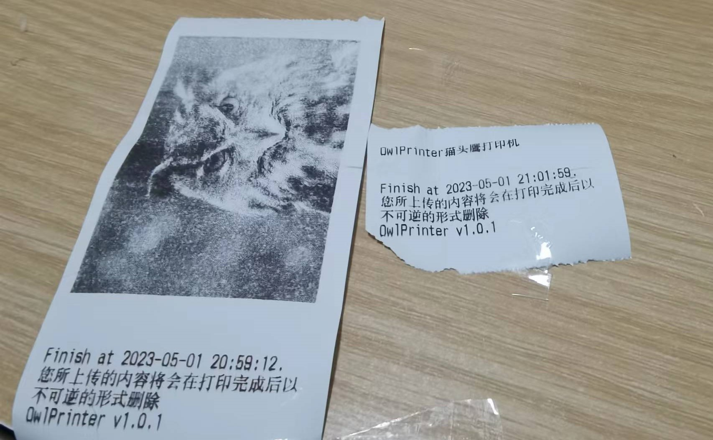

# README

## 简介

这是一个将热敏打印机改造为照片/文字打印机并使用微信小程序下发任务的项目。

打印效果：




小程序界面：


## 准备工作

+ 一台热敏打印机，以XPrinter XP-58IIH为例；由于该项目使用CUPS（Common Unix Printing System）进行打印，所以理论上有打印机对应的驱动即可。

+ 微信开发者账号。用于上线小程序，具体步骤不再赘述
+ 一台linux设备，armbian为佳，且具有至少一个usb接口，在此以Onecloud为例，本教程在Armbian 23.02.0-trunk Bullseye with Linux 6.1.0-meson下测试通过；树莓派好像也没问题
+ 一个域名【小程序要求后端域名必须是https，所以你需要一个域名以及域名的https证书（crt/key）】
+ linux基本知识
+ 准备好迎接挫折的心（

## Go！

在开始前先扯一句，如果你和我一样用打算用玩客云作为armbian设备，最方便的刷linux方法应该是使用[linux直刷包](https://github.com/hzyitc/armbian-onecloud),作者已经用workflow把编译好的包放到release了。如果想自己编译也可以试试[PR#126](https://github.com/hzyitc/armbian-onecloud/pull/126)。刷机过程不再赘述。

首先在linux设备上安装基本环境。

### CUPS配置

由于项目依赖CUPS，所以CUPS的安装当然是首当其冲的：`sudo apt install cups`

安装成功后，你还需要修改其配置文件以允许在局域网内访问cups管理后台。请对照着我的配置文件修改`/etc/cups/cupsd.conf`：

```xml
#
# Configuration file for the CUPS scheduler.  See "man cupsd.conf" for a
# complete description of this file.
#

# Log general information in error_log - change "warn" to "debug"
# for troubleshooting...
LogLevel warn
PageLogFormat

# Specifies the maximum size of the log files before they are rotated.  The value "0" disables log rotation.
MaxLogSize 0

# Default error policy for printers
ErrorPolicy retry-job

# Only listen for connections from the local machine.
Port 631 #########----------修改这里！----------------------
Listen /run/cups/cups.sock

# Show shared printers on the local network.
Browsing On
BrowseLocalProtocols dnssd

# Default authentication type, when authentication is required...
DefaultAuthType Basic

# Web interface setting...
WebInterface Yes

# Restrict access to the server...
<Location />
  Order allow,deny
  Allow all#########----------修改这里！----------------------
</Location>

# Restrict access to the admin pages...
<Location /admin>
  Order allow,deny
  Allow all#########----------修改这里！----------------------
</Location>

# Restrict access to configuration files...
<Location /admin/conf>
  AuthType Default
  Require user @SYSTEM
  Order allow,deny
  Allow all#########----------修改这里！----------------------
</Location>
#略

```

重启cups服务(`sudo systemctl restart cups`),并在局域网下访问机器Ip:631。如果能够成功访问，那请开始下一步。（啥，你说用你用的的frp？那当我没说）

### 安装热敏打印机驱动

请在google或github搜索你的打印机型号对应的驱动。这里我以XP-58IIH为例，我在[这里](https://github.com/klirichek/zj-58)找到了打印机的驱动，按照readme中的指示编译、安装成功了驱动。

### 在CUPS配置页面配置打印机

这步先忽略，如果你能成功进入cups配置页面，那你大概已经知道如何配置打印机了，只需按照页面指示即可

**如果打印机名字你把它设定为除了XP-58IIH以外的其他名称，记得在thermal.py中进行相应更改**

### 安装python及其环境

本项目依赖[python-escpos/python-escpos: Python library to manipulate ESC/POS printers (github.com)](https://github.com/python-escpos/python-escpos)，而该项目要求py3.7+，所以版本不符合要求的小伙伴们得考虑考虑virtualenv或者多个py环境共存了。

本项目需要安装的依赖：

+ python-escpos
+ pilow
+ flask
+ filetype

直接运行以下命令即可：
(过时)~~sudo apt install libcups2-dev && pip install -U git+https://github.com/python-escpos/python-escpos/pull/348/commits/f07d5e06109e37aa45a5a139f49f56d6399b98d3~~

更正：值得注意的是，python-escpos在PR#348前都是实验性功能，但在两周前这个PR被合并了，所以不再需要拉取并安装PR中的提交，直接进行相关pip安装即可。

``````~~

```
sudo apt install libcups2-dev && pip install -U pycups python-escpos pilow flask filetype
```
``````

### 小程序相关准备

首先将你的域名解析到linux设备的内网ip，然后批量替换小程序（文件夹miniprogram）中的YOUR_DOMAIN为你设定的域名:5583;端口号5583是flask的port，如果你想用nginx或者不想用这个端口记得更改。小程序的project.config.json中有一个appid，记得改成你自己的。之后就可以上传审核啦！相关步骤不再赘述。

###  后端相关准备

（我的例子）在根目录下新建/app文件夹，并把thermal.py和两个https证书扔进去。把thermal.py最后一行的CRT/KEY路径改掉，试着运行运行。没问题的话就继续下一步

如果你对systemd比较熟悉，你可以利用它管理后端进程。如果thermal.service中没有什么地方想改的话，就把他扔到/etc/systemd/system底下，daemon-reload->start->enable

## misc

这样大概就ok了。有遗漏的地方我想起来再写

## License

Just follow dependencies' license